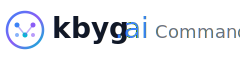
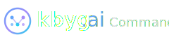

# KBYG.ai Command Center Logo Variations

This directory contains 23 logo variations for KBYG.ai Command Center, optimized for different use cases and contexts.

## 📁 File Structure

```
variations/
├── Primary Logos (5)
├── White Logos (5)
├── Dark Logos (5)
├── Icon-Only (8+)
└── README.md
```

---

## 🎨 Primary Logos (Light Backgrounds)

Use these on white or light-colored backgrounds.

### `logo-primary-horizontal.svg`
**240×60px** • Horizontal layout with "Command Center" subtitle
- **Use for:** Headers, email signatures, wide banners
- **Best fit:** Website headers, email footers
- **Text:** "kbyg.ai Command Center" in one line

### `logo-primary-vertical.svg`
**140×140px** • Vertical stacked layout
- **Use for:** Social media profiles, app icons with text
- **Best fit:** Square spaces where height is available
- **Text:** Logo name centered above "Command Center"

### `logo-primary-stacked.svg`
**180×100px** • Icon left, text stacked right
- **Use for:** Letterheads, presentations, documents
- **Best fit:** Professional documents, slides
- **Text:** Logo name with subtitle below

### `logo-primary-compact.svg`
**120×40px** • Minimal horizontal version
- **Use for:** Tight spaces, navigation bars, mobile headers
- **Best fit:** Limited space, mobile responsive layouts
- **Text:** Just "kbyg.ai" with icon

### `logo-primary-full.svg`
**300×80px** • Full horizontal with larger icon
- **Use for:** Hero sections, landing pages, print materials
- **Best fit:** Large format displays, marketing materials
- **Text:** Full branding with prominent icon

---

## 🌙 White Logos (Dark Backgrounds)

Use these on dark, colored, or image backgrounds.

### `logo-white-horizontal.svg`
**240×60px** • Horizontal with light gradient
- **Use for:** Dark mode interfaces, night themes
- **Background:** Dark gray (#1f2937), black, navy
- **Features:** Lighter gradient (#60a5fa → #a78bfa → #22d3ee)

### `logo-white-vertical.svg`
**140×140px** • Vertical stacked for dark backgrounds
- **Use for:** Dark social media posts, video overlays
- **Background:** Any dark color
- **Features:** White text with light blue gradient icon

### `logo-white-stacked.svg`
**180×100px** • Stacked for dark presentations
- **Use for:** Dark mode slides, reports
- **Background:** Charcoal, black, dark purple
- **Features:** Full visibility on dark surfaces

### `logo-white-compact.svg`
**120×40px** • Minimal white version
- **Use for:** Dark mobile apps, toolbars
- **Background:** Dark UI elements
- **Features:** Clean, minimal footprint

### `logo-white-full.svg`
**300×80px** • Full branding for dark backgrounds
- **Use for:** Dark hero sections, premium materials
- **Background:** Elegant dark backgrounds
- **Features:** Maximum brand presence on dark

---

## ⚫ Dark Logos (Ultra-Light Backgrounds)

Use these on pure white or very light backgrounds where primary might be too saturated.

### `logo-dark-horizontal.svg`
**240×60px** • Darker gradient version
- **Use for:** Clean minimalist designs, printables
- **Background:** Pure white (#ffffff), cream, light gray
- **Features:** Darker gradient (#1e40af → #5b21b6 → #0e7490)

### `logo-dark-vertical.svg`
**140×140px** • Vertical with dark tones
- **Use for:** Print business cards, professional portfolios
- **Background:** Bright white surfaces
- **Features:** Strong contrast, professional appearance

### `logo-dark-stacked.svg`
**180×100px** • Stacked with dark palette
- **Use for:** Official documents, contracts
- **Background:** Paper-white, pristine surfaces
- **Features:** Formal, authoritative look

### `logo-dark-compact.svg`
**120×40px** • Compact dark version
- **Use for:** Minimal interfaces, clean UIs
- **Background:** Off-white, subtle patterns
- **Features:** Restrained, elegant

### `logo-dark-full.svg`
**300×80px** • Full dark branding
- **Use for:** Premium print materials, packaging
- **Background:** High-end light surfaces
- **Features:** Sophisticated, professional

---

## 🎯 Icon-Only Variations

Use when space is limited or logo is already established in context.

### Size-Specific Icons

#### `icon-16.svg` (16×16px)
- **Use for:** Favicons, tiny UI elements
- **Features:** Ultra-simplified, minimal detail
- **Context:** Browser tabs, taskbar icons

#### `icon-32.svg` (32×32px)
- **Use for:** Small app icons, notification badges
- **Features:** Basic neural network visible
- **Context:** System trays, small buttons

#### `icon-64.svg` (64×64px)
- **Use for:** Standard app icons, profile pictures
- **Features:** Full detail, all elements visible
- **Context:** Desktop apps, social avatars

#### `icon-128.svg` (128×128px)
- **Use for:** High-resolution displays, app stores
- **Features:** Maximum detail, crisp scaling
- **Context:** App store listings, Retina displays

### Styled Icon Variations

#### `icon-filled.svg` (64×64px)
- **Style:** Gradient-filled circle background
- **Use for:** App icons, social media, badges
- **Features:** High contrast, stands out
- **Best on:** Any background (self-contained)

#### `icon-rounded-square.svg` (64×64px)
- **Style:** Rounded square with gradient fill
- **Use for:** iOS app icons, modern UI elements
- **Features:** App-like appearance
- **Best on:** iOS guidelines, square icon grids

#### `icon-minimal.svg` (48×48px)
- **Style:** Just the brain outline + 3 nodes
- **Use for:** Subtle branding, watermarks
- **Features:** Understated, elegant
- **Best on:** Light backgrounds, minimal designs

#### `icon-monochrome.svg` (64×64px)
- **Style:** Single blue color, no gradient
- **Use for:** Print materials, single-color contexts
- **Features:** Simplified for reproduction
- **Best on:** Limited color printing, stamps

---

## 📐 Usage Guidelines

### Choosing the Right Logo

| Context | Recommended Logo | Notes |
|---------|-----------------|-------|
| Website header | `primary-horizontal` | Full branding visible |
| Dark mode header | `white-horizontal` | Optimized for dark |
| Mobile navigation | `primary-compact` | Space-efficient |
| Social media profile | `icon-filled` | Recognizable at small sizes |
| Email signature | `primary-horizontal` | Professional, complete |
| Presentation title | `primary-full` | Large, impactful |
| Favicon | `icon-16` | Browser-optimized |
| App icon | `icon-rounded-square` | Platform-standard |
| Print business card | `dark-stacked` | Print-optimized |
| Loading spinner | `icon-minimal` | Clean, unobtrusive |

### Spacing & Clearance

- **Minimum clearspace:** Height of icon (circle diameter)
- **Minimum size:** Don't scale below 32px height for text logos
- **Icon minimum:** 16px for icon-only versions

### Don't:
- ❌ Change colors or gradients
- ❌ Rearrange elements
- ❌ Add effects (shadows, glows)
- ❌ Stretch or distort
- ❌ Place on busy backgrounds without container
- ❌ Use low-contrast combinations

### Do:
- ✅ Maintain aspect ratios
- ✅ Use white logos on dark backgrounds
- ✅ Use dark logos on bright white
- ✅ Allow proper clearspace
- ✅ Scale proportionally
- ✅ Test readability at intended size

---

## 🎨 Color Specifications

### Primary Gradient
```
Blue: #3b82f6
Purple: #8b5cf6
Cyan: #06b6d4
```

### White/Light Gradient
```
Light Blue: #60a5fa
Light Purple: #a78bfa
Light Cyan: #22d3ee
```

### Dark Gradient
```
Dark Blue: #1e40af
Dark Purple: #5b21b6
Dark Cyan: #0e7490
```

### Text Colors
- **Primary text:** #111827 (near-black)
- **White text:** #ffffff
- **Dark text:** #030712 (black)
- **Subtitle (light):** #6b7280 (gray)
- **Subtitle (dark):** #d1d5db (light gray)

---

## 📦 Export & Implementation

All logos are provided as scalable **SVG** files for maximum quality and flexibility.

### Web Implementation
```html
<!-- Inline SVG for best control -->


<!-- Dark mode variant -->

```

### CSS Dark Mode
```css
/* Auto-switch based on system preference */
.logo-primary {
  content: url('logo-primary-horizontal.svg');
}

@media (prefers-color-scheme: dark) {
  .logo-primary {
    content: url('logo-white-horizontal.svg');
  }
}
```

### Favicon Implementation
```html
<link rel="icon" type="image/svg+xml" href="icon-16.svg">
<link rel="apple-touch-icon" sizes="180x180" href="icon-128.svg">
```

---

## 📝 Notes

- All files maintain the original design language
- Neural network pattern represents AI intelligence
- Gradient represents innovation and technology
- Circle represents completeness and global reach
- Inter font family recommended for text (weight 300-800)

**Created:** 2024
**Version:** 1.0
**Format:** SVG (Scalable Vector Graphics)
**License:** Proprietary - KBYG.ai Command Center

---

For questions or custom variations, contact the brand team.
